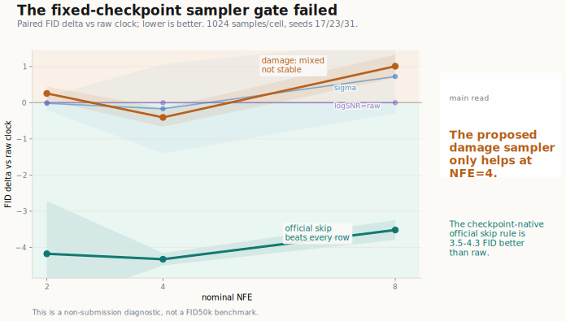
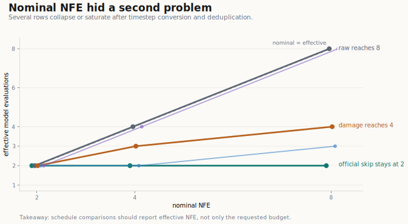
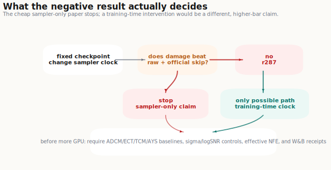

<article class="research-note">
  <header class="note-hero">
    <nav class="note-breadcrumb" aria-label="Breadcrumb">
      <a href="{{ '/' | relative_url }}#research-notes">Notes</a>
      /
      negative result
    </nav>
    <h1>When a Better Clock Is Not a Better Sampler</h1>
    
A negative result from testing damage-aligned clocks for few-step consistency sampling.

    

      June 16, 2026
      ImageNet-64 diagnostic
      Consistency models
    

  </header>

  

A few-step generator is a brutal budget allocator. If we only get two, four, or eight model evaluations, every step has to matter. That makes a simple hypothesis tempting: raw diffusion time may be the wrong axis to spend those steps on. Equal intervals in raw time do not necessarily mean equal changes in the final denoised image. Maybe a sampler should step through a clock aligned to endpoint damage instead.

This post is about the cheapest version of that hypothesis, and why it failed.

We kept a pretrained ImageNet-64 consistency checkpoint fixed. We changed only the sampler grid. We compared a damage-aligned clock against raw time, simple coordinate controls, and the official checkpoint-native skip-step rule. The damage clock did not produce a stable gain. More importantly, the official skip-step rule was much stronger across every tested budget.

That is a negative result, but it is a useful one. It killed a cheap research direction before we spent real training compute on it, and it forced a cleaner standard for future clock or schedule papers: report effective NFE, include inherited sampler baselines, and treat sigma/logSNR controls as mandatory.

## The Hypothesis

The idea started from a mismatch between a coordinate and an effect. Diffusion and consistency models are usually described along a time or noise axis. But for few-step generation, the relevant object is not the coordinate itself. It is how much each chosen interval changes the endpoint prediction.

If raw time spends too many steps in regions that barely change the endpoint, and too few in regions where the endpoint changes rapidly, then a damage-aligned clock looks attractive. Fit a monotone clock from teacher trajectories. Place the few available steps evenly on that clock. Ideally, the sampler spends its budget where endpoint damage actually moves.

This is visually intuitive. It is also dangerous, because it lives in a crowded neighborhood.

## The Trap

Once you describe the idea as "choose better timesteps," several existing lines of work immediately become reviewer pressure.

- **Sampling schedule optimization.** Align Your Steps showed that optimized sampling schedules can matter a lot in the few-step regime for diffusion models.
- **Train-inference schedule mismatch.** Common Diffusion Noise Schedules and Sample Steps Are Flawed showed that apparently small schedule conventions can create real train/inference incongruence.
- **Consistency-model discretization.** Adaptive Discretization for Consistency Models directly treats discretization inside consistency training as an adaptive optimization problem.
- **Efficient consistency tuning.** Consistency Models Made Easy showed that checkpoint-initialized consistency tuning can be dramatically more efficient than training a consistency model from scratch.
- **Time-range allocation.** Truncated Consistency Models explicitly changes which time ranges the consistency model needs to learn.

So the novelty target was narrow from the beginning. A damage clock would need to be more than another sampler schedule, more than logSNR in disguise, and more than adaptive training discretization with a new name.

That is why we ran a sampler-only gate first. If changing the sampler grid on a fixed checkpoint already worked, the paper might become a sampler-clock paper. If it failed, we would know not to keep burning compute on the cheapest claim.

## The Experiment Contract

The run was deliberately bounded. It was not a submission-facing FID50k experiment. It was a diagnostic gate.

- **Checkpoint:** `openai/diffusers-cd_imagenet64_l2`
- **Dataset/evaluator:** ImageNet-64 reference statistics through the paper-local OpenAI evaluator path
- **Mode:** sample/evaluate only; no training
- **Rows:** `raw_raw`, `raw_damage`, `raw_shared_sigma`, `raw_shared_logsnr`, `official_raw_skip`
- **Nominal NFE budgets:** 2, 4, 8
- **Sampling seeds:** 17, 23, 31
- **Samples per cell:** 1024
- **Cells:** 45
- **Evidence status:** non-submission diagnostic

The row names are intentionally literal. `raw_raw` is the inherited raw-time sampler. `raw_damage` keeps the checkpoint fixed and samples on the damage grid. `raw_shared_sigma` and `raw_shared_logsnr` are simple-coordinate controls. `official_raw_skip` is the checkpoint-native skip-step anchor.

## Result: the Official Skip Rule Wins

The most important plot is the paired FID delta against `raw_raw`. Negative is better than the raw-clock sampler. Positive is worse.

<figure class="note-figure">
  
  <figcaption>Paired FID delta versus the raw-clock sampler. Negative values are better than raw time.</figcaption>
</figure>

The damage clock did not produce a stable improvement:

- At nominal NFE 2, `raw_damage` was worse than `raw_raw` by **+0.255 FID**.
- At nominal NFE 4, `raw_damage` was better by **-0.407 FID**.
- At nominal NFE 8, `raw_damage` was worse by **+1.008 FID**.

That is not a reliable sampler-only effect.

The stronger result is that `official_raw_skip` dominated the internal clock rows. Compared with `raw_raw`, the official skip rule was better by roughly **3.5 to 4.3 FID** across the tested budgets. Compared with `raw_damage`, it was also much stronger across the board.

The absolute mean FIDs tell the same story.

There was also a diagnostic surprise: `raw_shared_logsnr` matched `raw_raw` exactly in this adapter. That does not prove logSNR is always irrelevant. It says that in this fixed-checkpoint path, our attempted logSNR control did not create a separable sampler trajectory from raw time. That is useful to know before building a claim around it.

## Nominal NFE Was Not Enough

One of the practical lessons was that nominal NFE can lie.

After timestep conversion and deduplication, different rows used different effective model-evaluation counts. The official raw skip row collapsed to two effective transitions across nominal NFE 2, 4, and 8 in this adapter. Some damage and sigma rows also collapsed or saturated earlier than their nominal budgets suggested.

<figure class="note-figure">
  
  <figcaption>Effective NFE after timestep conversion and deduplication. Nominal budgets can hide collapsed trajectories.</figcaption>
</figure>

This matters because a paper can accidentally compare "NFE=8" labels while the actual sampler path is not using eight distinct effective transitions. For schedule papers, the manifest should report both nominal NFE and effective NFE. Otherwise a claimed improvement may be an accounting artifact.

## Why This Failed

The failure mode is not mysterious in hindsight.

A pretrained consistency checkpoint is not a neutral object. Its training procedure, timestep distribution, and inherited sampler conventions already define a contract. Changing the sampler grid after the fact can easily create a mismatch rather than a better allocation of computation.

That is exactly what the official skip-step anchor exposed. The damage grid was not competing against an abstract raw-time strawman. It was competing against the sampler rule that the checkpoint actually expects. Once that baseline was included, the apparent room for a sampler-only contribution mostly disappeared.

This is the useful part of the negative result. The experiment did not prove that endpoint damage is a bad measurement. It proved that **post-hoc damage-clock sampling on a fixed checkpoint was not enough**.

## What This Changes

The decision tree after this result is simple.

<figure class="note-figure">
  
  <figcaption>The fixed-checkpoint gate stops the sampler-only paper and moves any remaining hypothesis to matched training-time allocation.</figcaption>
</figure>

The sampler-only paper should stop. Repeating the same fixed-checkpoint experiment at larger sample counts would mostly make the negative result more expensive.

A training-time version remains logically possible, but it is a different paper. It would need to show that training-pair allocation and sampling should share the damage clock. That means a matched-budget matrix, not a sampler-only gate:

- `raw/raw`
- `raw/damage`
- `damage/raw`
- `damage/damage`
- `shared_sigma/shared_sigma`
- `shared_logsnr/shared_logsnr`
- official or inherited raw skip-step anchor
- nearest-method baselines from ADCM/ECT/TCM/AYS-style settings

It should start from a checkpoint-initialized small-standard pilot, with W&B logging and precommitted effect-size criteria. It should not resurrect a full 800k-step single-GPU ImageNet-64 run just because GPUs are available. That would test endurance, not the hypothesis.

## What I Would Reuse

This failed run left a few durable rules.

1. **Run the cheap sampler gate before training.** If a proposed clock cannot beat the checkpoint-native sampler on a fixed checkpoint, do not assume training will rescue it.
2. **Always include the inherited sampler baseline.** Raw time is not the only baseline. Official skip-step behavior can be much stronger.
3. **Report effective NFE.** Nominal NFE is a label; effective transitions are the computational object.
4. **Treat sigma/logSNR controls as hard gates.** A new clock must survive simple coordinate baselines before it can claim a distinct mechanism.
5. **Write negative receipts.** A failed gate is not wasted if it prevents weeks of irrelevant training.

## Evidence Ledger

This post is based on one bounded diagnostic run, `r287-hf-fixed-checkpoint-controls-multiseed-n1024`.

- Source metric JSON: `r287-hf-fixed-checkpoint-controls-multiseed-n1024/...sample_evaluate_only.json`
- Public summary JSON: [`data/r287_summary.json`](data/r287_summary.json)
- Mean FID table: [`data/r287_mean_fid.csv`](data/r287_mean_fid.csv)
- Paired-delta table: [`data/r287_delta_vs_raw.csv`](data/r287_delta_vs_raw.csv)

The run completed successfully, but it is explicitly non-submission-facing: 1024 samples per cell, three sampling seeds, and no training. Treat it as a go/no-go diagnostic, not as a publishable benchmark table.

## References

- Align Your Steps: Optimizing Sampling Schedules in Diffusion Models. <https://arxiv.org/abs/2404.14507>
- Common Diffusion Noise Schedules and Sample Steps Are Flawed. <https://arxiv.org/abs/2305.08891>
- Adaptive Discretization for Consistency Models. <https://arxiv.org/abs/2510.17266>
- Consistency Models Made Easy. <https://arxiv.org/abs/2406.14548>
- Truncated Consistency Models. <https://arxiv.org/abs/2410.14895>
- Improving Reproducibility in Machine Learning Research: A Report from the NeurIPS 2019 Reproducibility Program. <https://arxiv.org/abs/2003.12206>
- ReScience C. <https://rescience.github.io/>

  

</article>
